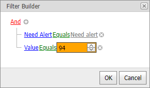

<!-- default badges list -->
[](https://supportcenter.devexpress.com/ticket/details/T300124)
[](https://docs.devexpress.com/GeneralInformation/403183)
<!-- default badges end -->

# Grid for ASP.NET Web Forms - How to customize the default editor in the built-in the Filter Builder
<!-- run online -->
**[[Run Online]](https://codecentral.devexpress.com/t300124/)**
<!-- run online end -->

This example demonstrates how to customize the default editor in the built-in the [Filter Builder](https://docs.devexpress.com/AspNet/5138/components/grid-view/concepts/filter-data/filter-control).



The [ASPxGridView](https://docs.devexpress.com/AspNet/DevExpress.Web.ASPxGridView) control implements the following events to customize editors in the Filter Builder:

* [FilterControlCriteriaValueEditorCreate](https://docs.devexpress.com/AspNet/DevExpress.Web.ASPxGridBase.FilterControlCriteriaValueEditorCreate) allows you to replace the default [criteria value](https://docs.devexpress.com/AspNet/11155/components/data-editors/aspxfiltercontrol/visual-elements#criteria-value) editor with a custom one. In the event handler, you can set basic editor properties.
  ```cs
  protected void grid_FilterControlCriteriaValueEditorCreate(object sender, FilterControlCriteriaValueEditorCreateEventArgs e) {
      if(e.Column.PropertyName == "NeedAlert") {
          e.EditorProperties = CreateComboBoxProperties(e.Value);
      }
  }
  EditPropertiesBase CreateComboBoxProperties(object value) {
      bool v = value != null && (bool)value;
      var props = new ComboBoxProperties();
      props.ValueType = typeof(bool);
      props.Items.Add(new ListEditItem("Need alert", true) { Selected = v });
      props.Items.Add(new ListEditItem("Is's ok", false) { Selected = !v });
      return props;
  }
  ```
* [FilterControlCriteriaValueEditorInitialize](https://docs.devexpress.com/AspNet/DevExpress.Web.ASPxGridBase.FilterControlCriteriaValueEditorInitialize) allows you to initialize the editor and customize its properties.
  ```cs
  protected void grid_FilterControlCriteriaValueEditorInitialize(object sender, FilterControlCriteriaValueEditorInitializeEventArgs e) {
      if(e.Value == null)
          return;
      if(e.Column.PropertyName == "Value") {
          InitializeSpinEdit(e.Editor, e.Value);
      }
  }
  void InitializeSpinEdit(ASPxEditBase editor, object value) {
      var spinEdit = editor as ASPxSpinEdit;
      var intValue = (int)value;
      spinEdit.BackColor = Color.LightGreen;
      if(intValue > 10)
          spinEdit.BackColor = Color.Orange;
      if(intValue > 100)
          spinEdit.BackColor = Color.Red;
      if(intValue > 1000)
          spinEdit.BackColor = Color.DarkRed;
      if(intValue > 10000)
          spinEdit.BackColor = Color.Black;
  }
  ```
* [FilterControlCustomValueDisplayText](https://docs.devexpress.com/AspNet/DevExpress.Web.ASPxGridBase.FilterControlCustomValueDisplayText) allows you to specify custom display text for the editor.
  ```cs
  protected void grid_FilterControlCustomValueDisplayText(object sender, FilterControlCustomValueDisplayTextEventArgs e) {
      if (e.PropertyInfo.PropertyName == "NeedAlert") {
          if (e.Value == null)
              return;
          e.DisplayText = (bool)e.Value ? "Need alert" : "Is's ok";
      }
  }
  ```


## Files to Review

* [Default.aspx](./CS/Default.aspx) (VB: [Default.aspx](./VB/Default.aspx))
* [Default.aspx.cs](./CS/Default.aspx.cs) (VB: [Default.aspx.vb](./VB/Default.aspx.vb))

## Documentation

* [Filter Control](https://docs.devexpress.com/AspNet/5138/components/grid-view/concepts/filter-data/filter-control)
